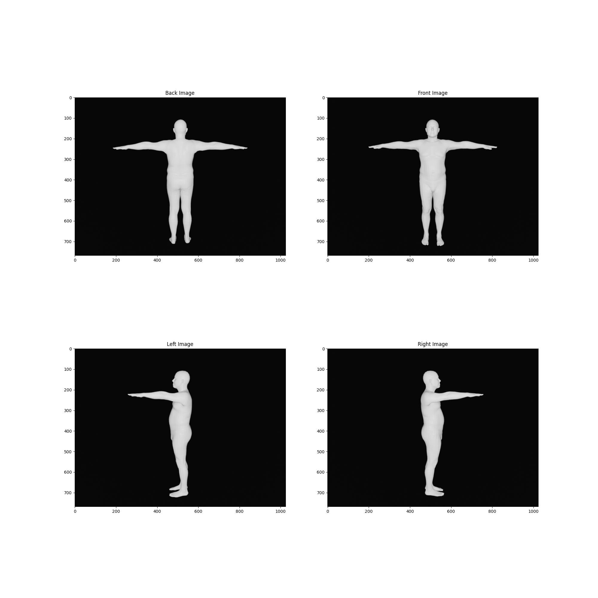

# Pose Orientation Classifier

## Purpose

This project aims to classify the orientation of images into four categories: `back`, `front`, `left`, and `right`. The project includes scripts for training, evaluating, and inferring the orientation of images using a deep learning model.
Below is an example image showing the four orientations that the model can classify:



##  Model Architecture

The chosen model architecture consists of a backbone network for feature extraction and fully connected (FC) layers for classification. The backbone network is a pre-trained ResNet model, and the FC layers are used to map the extracted features to the four orientation classes.

### Backbone

The backbone network is a pre-trained ResNet model from the `timm` library. It extracts the last feature map from the input images.

### Fully Connected Layers

The FC layers consist of:
- A dropout layer with a probability of 0.5
- A linear layer with 128 units and ReLU activation
- Another dropout layer with a probability of 0.5
- A final linear layer with 4 units (one for each class)

## Usage

### Training

To train the model, use the `train.py` script. The script defines the data augmentation, loads the dataset, and trains the model using PyTorch Lightning.

### Evaluation

To evaluate the model, use the `test.py` script. The script loads the trained model and evaluates its performance on a test dataset.

### Inference

To classify and split unstructured images by orientation, use the `split_files.py` script. The script loads the trained model, processes the images, and saves them into corresponding folders based on their predicted orientation.

#### Example Command

```sh
python split_files.py --input_dir path/to/input/images --output_dir path/to/output/folders --model_path path/to/model/checkpoint --batch_size 32
```

## 📂 Dataset Organization

The dataset should be organized into subdirectories for each asset, with images named to indicate their orientation. Here is an example of how the directory should be organized:

```
data/
    person1/
        image_front.jpg
        image_back.jpg
        image_left.jpg
        image_right.jpg
    person2/
        image_front.jpg
        image_back.jpg
        image_left.jpg
        image_right.jpg
    person3/
        image_front.jpg
        image_back.jpg
        image_left.jpg
        image_right.jpg
    ...
```

## 📄 Provided Files

- `train.py`: Script for training the model.
- `test.py`: Script for evaluating the model.
- `split_files.py`: Script for classifying and splitting unstructured images by orientation.
- `dataset.py`: Sample dataset class for loading and preprocessing the images.

## 📝 TODO

- Add `requirements.txt` to specify the dependencies needed to run the project.


